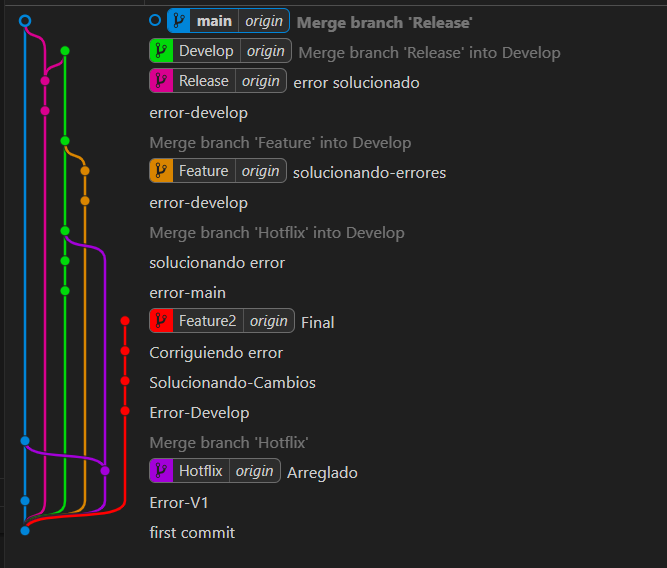

# Entornos de desarrollo : Tarea Tema 18.
## Objetivo: Explicar todos los comandos que se han realizado a lo largo de la actividad con las ramas

### 1. Crear ramas
Para crear las ramas utilizamos el comando: git add <Nombre de la Rama>
### 2. Guardar commits
Para guardar los commits utilizamos el comando: git commit -m "Aqui pones el mensaje descriptivo del commits"
### 3. Subir commits
Para subir los commits utilizamos el comando: git push
### 4. Merge
Para realizar el merge utilizamos el comando: git merge Poner el nombre de laa rama que queremos combinar

## Intergaz Grafica.
Para hacer todas las cosas que hemos explicado antes se puede hacer por comando o por interfaz grafica que es de la manera que yo lo he hecho.

### 1. Crear ramas
Nos vamos a BRANCHES y le damos al + ponemos el nombre de la raama que queremos crear, intro y por ultimo le damos a crear branch.
### 2. Guardar commits
Seleccionamos los archivos que queremos hacer commit ponemos un mensaje descriptivo y le damos a confirmacion.
### 3. Subir commits
Para subir los commits solo le teneemos que dar a sincronizar.
### 4. Merge
Para hacer un merge lo primeo es situarnos en la rama que queremos, le damos a control de código fuente a los tres puntos rama y combinar y por ultimo seleccionamos la rama que qremos combinar

